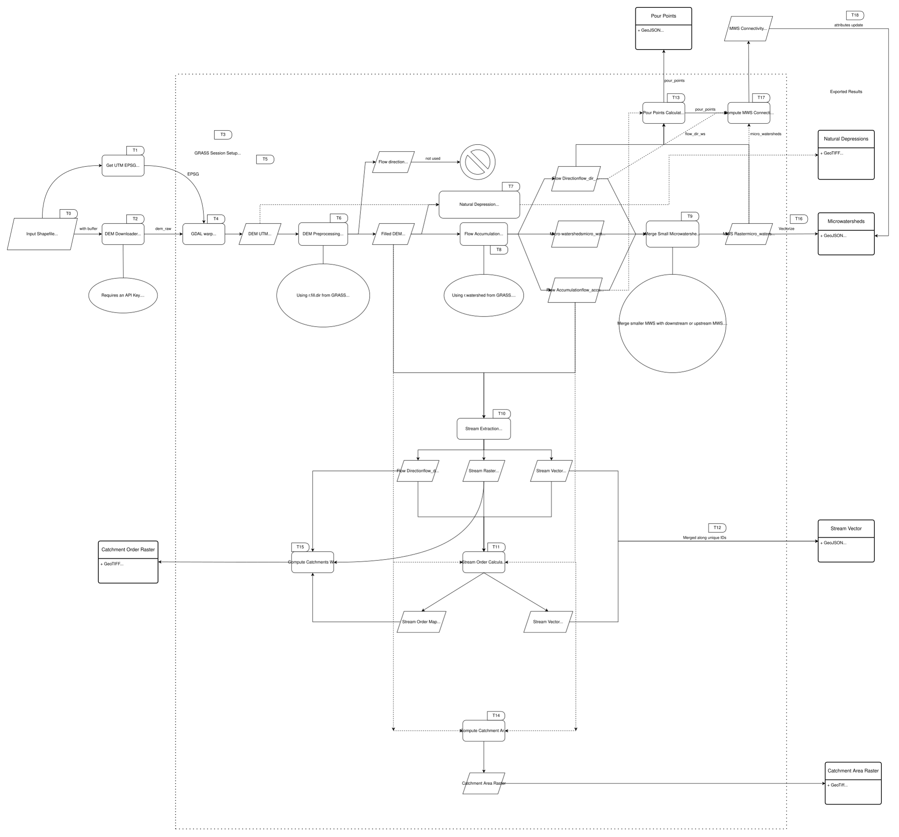

# Hydrological Analysis
This is an automated workflow that takes any basin as input, downloads the corresponding Digital Elevation Model (DEM) or Digital Surface Model (DSM) from OpenTopography and runs standard hydrology algorithms for the given area of interest. The input is a vector that can be either GeoJSON, GPKG, ESRI Shapefile, or KML/KMZ file describing the geometry of the watershed and the output is natural depressions map, drainage networks, delineated micro-watersheds, pour points map, micro-watershed connectivity graph, and catchment with strahler order raster. 

The workflow can handle areas upto 150,000 sq.kms. at 30 m DEM resolution in practical amount of time. This will help generate the above layers for the watershed so that decisions pertaining to water security planning and other watershed management activities can be made better with the additional hydro-geomorphic information.

One of our key contributions also include the micro-watershed merging algorithm that merges smaller micro-watersheds in a hydrologically consistent manner so that the final distribution of areas of the micro-watersheds are such that they are suitable for local level planning. 


Fig: The flowchart describing the modules and the data flow

## Architecture and environment requirement
The workflow is designed to run in a Linux based execution environment. The workflow is packaged inside a Docker container and thus it can be deployed on any AMD64 and ARM64 based device provided it supports Docker and the Docker environment is configured to provide network access to the container.

## Hardware Related Requirements
For smaller regions of interest, the workflow can run even on laptops with 8 GB RAM. But workstations with higher RAM and better processing speed would permit larger level analysis. 

Comment: For analysis of basins of size ~150,000 sq.kms., we used a workstation with 128 GB RAM, 12 Core CPU and with processor speed of 3.6 GHz. 
## Setup for running the workflow
Here we provide detailed instructions to setup and run the workflow. 

1. Install Docker. Configure the Docker so that it is connected to your run time environment (Linux Terminal, WSL for Windows etc.). Also ensure that the docker container can have access to internet. 

2. Clone the repository. 
```
git clone https://github.com/mastershubham/hydro_stack.git
cd hydro_stack
```

3. One can either pull the image from DockerHub or they can build the image themselves from the Dockerfile in the repository.  
**Pulling the image from DockerHub**
```
docker pull shubham8625/hydro-pipeline:latest
```
or,

**Building the image from Dockerfile**

```
docker build -t <name_of_the_image> .
```
For example, one could name the image `hydro_image` and thus they could build the image as:
```
docker build -t hydro_image .
```
4. Run the pipeline after mounting the data and the necessary files/folders into the container.
```
docker run -it -w $(pwd) -v $(pwd):$(pwd) <name_of_the_image> bash
```
Here, the -it flag lets one run in the interactive mode (-i) inside a pseudo-terminal (-t) that is provided to the OS inside the container. Thus one could fire commands inside the container by the terminal kind of environment provided.

We are also setting the container working directory to the current directory (`-w $(pwd)`).

We are also mounting the present working directory (pwd) into the container at the same path (`-v $(pwd)`). This provides all the project files (modulo those in .dockerignore) in the container. 

`name_of_the_image` specifies the image to run. You could use either of the shubham8625/hydro-pipeline:latest or the custom name of the image you build previously (like hydro_image). Caution: Do not include the angle bracket while passing the name of the image. 

5. Inside the container, first upload your [OpenTopography API Key](https://opentopography.org/) into the container. You can work with the default access provided. If you want to experiment with various regions, then you might have to download a lot of DEM tiles. For that, you can request for academic access from them. 
```
echo "OPEN_TOPOGRAPHY_KEY" > ~/.opentopography.txt
```

6. Finally, you can run the below python command from inside the container. It takes input as the path to the watershed vector through `--shp` parameter and outputs the generated maps and some intermediate files in the specified output directory (following the `--output` parameter). 

For example, we have given a region (it is an administrative region and not a watershed, but for sake of demonstration we can run our analysis on it) in the data directory. The corresponding code runs the analysis pipeline for the region.

```
python hydrological_analysis.py --shp ./data/masalia_tehsil_boundary.shp --output masalia --grassdb ~/grassdata
```


## Visualizing Micro-watershed connectivity
If one want to visualize the micro-watershed connectivity in a flat matplotlib image, then they can use the provided auxiallary script to do so.

1. Run docker in the interactive mode. This is similar to the step for running the analysis. If one is already inside the Docker container, then they need not run it.
```
docker run -it -w $(pwd) -v $(pwd):$(pwd) <name_of_the_image> bash
```
2. Then run the visualization script for micro-watershed connectivity.
```
python visualize_mws_connectivity.py
```
One needs to specify the file paths for the appropriate watershed related files in `visualize_mws_connectivity.py`. These are present at the start of the script. 

This script has limitations as flat images lead to clustering when the region of interest is large and thus the generated images are not useful. One then needs interactive maps for visualization.

### Interactive map to visualize Micro-watershed connectivity
To generate interactive map, run the follwing command from inside the container.

```
python ./utils/mws_conn_viz.py
```

## Analyzing the distribution of areas of the micro-watersheds

One can use the scripts provided at [mastershubahm/hydrology_eval](https://github.com/mastershubham/hydrology_eval) to analyze the distribution of the areas of the micro-watersheds generated through this workflow. 

```
Again, at the start of the script, one has to specify the path of the appropriate files.
